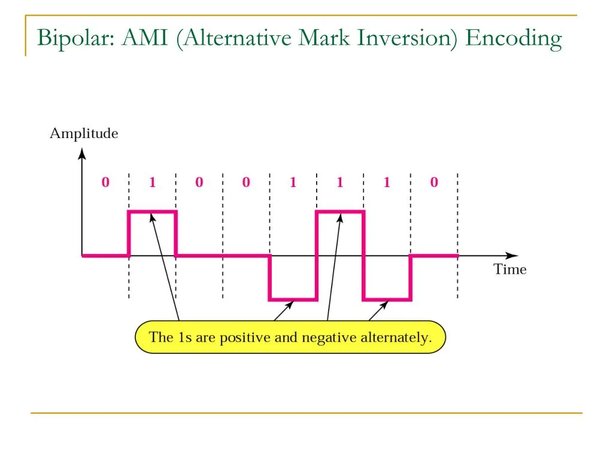

# Bipolar Alternate Mark Inversion

This repository contains two firmware implementations of **Bipolar AMI (Alternate Mark Inversion)** line coding for the **PSOC6 CY8CPROTO-062-4343W** development board.
 The project compares a **bit-banged software implementation** with a **hardware-accelerated Smart I/O solution**.

---

# What is Bipolar AMI

Bipolar AMI is a line coding technique using **three voltage levels**:

- `+V` for a logical `1`
- `–V` for the next logical `1` (alternating polarity)
- `0V` for a logical `0`

Advantages:

- Eliminates the DC component
- Improves synchronization
- Supports simple error detection



---


# Solution 1- Bit-Banged Bipolar AMI (Firmware Only)

The first implementation uses manual **bit-banging in C** to generate the AMI waveform.
 This approach is easy to understand but limited:

### Pros

- Simple C code

### Cons 

-  Very slow at higher bitrates
- Timing accuracy depends on CPU board

### Source code

 [firmware/AMI_BitBanging](firmware/AMI_BitBanging/AMI_BitBanging)

---

# Solution 2-  Bipolar AMI using smart I/O  

The second implementation uses **Smart I/O**, a hardware block inside the PSOC6 that can generate output patterns using:

- LUTs (Look-Up Tables)
- DU (Data Unit) logic
- Smart I/O routing

###  Pros

- Higher performance
- More accurate waveform
- No CPU usage

### Cons

- Requires more hardware knowledge
- LUT and routing setup has a learning curve

**Source code:**

[firmware/AMI_smartIO](firmware/AMI_SmartIO/AMI_SmartIO)

---

# SPI master code for Pico
The spi master code we have used in our design can be found here : [source code pico](firmware/spi_master)


# Hardware Requirements

- PSOC6 CY8CPROTO-062-4343W development board
- Oscilloscope (recommended)
- Logic analyser (optional)
- Jumper wires
- Second MCU or signal source to provide data input

# Repository Structure

```
.
├── firmware/
│   ├── AMI_BitBanging/   # bit-banging implementation
│   └── AMI_SmartIO/      # Smart I/O implementation
├── resources/
│   └── pictures/
└── README.md
```


