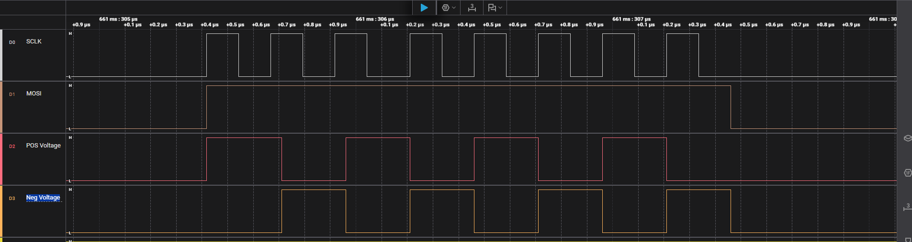

# Bipolair AMI

This app is specially set-up to make as fast as possible an Bipolar Alternate Mark Inversion encoding program with the use of smart I/O.

The code is designed in Smart I/O configurator with the use of 3 LUT tables and the DU, Data Unit. 

In this design we used the CY8CPROTO-062S3-4343W, but you can change this to your 'target' device. 

## Hardware setup

For our set-up we made use of a raspberry pi Pico as the SPI-Master which send his data out to the PSOC CY8CPROTO-062S3-4343W, the connection is made like the follow table: 

|             | Pico | PSOC |
| ----------- | ---- | ---- |
| Gnd         | Gnd  | Gnd  |
| SCLK        | GP18 | P9_1 |
| MOSI        | GP19 | P9_7 |
| POS Voltage |      | P9_4 |
| NEG voltage |      | P9_5 |

## Output screenshot

First image settings : PIco  4MHz  Data : 0xAA

second Image settings: Pico 4Mhz Data: 0xFF

