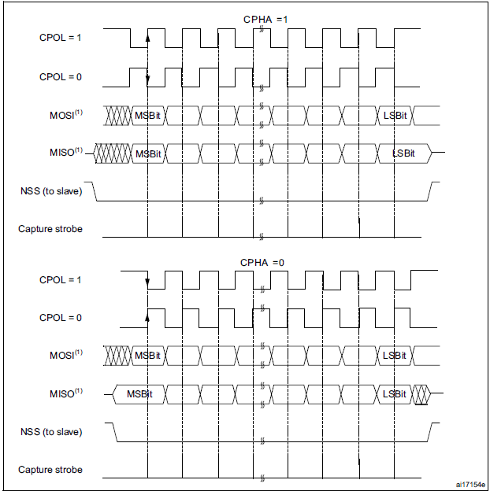
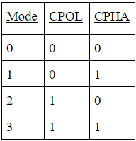

# SPI Master

This is the code we have used for our master data sender to the PSOC CY8CPROTO-062S3-4343W


For our solution we have noticed that the data is raising high on the falling edge of SCLK, this is why we have changed the CPHA to 1 so the data is rising 

therefore we have changed the SPI setting  with this line

```c
  spi_set_format(SPI_PORT, 8, SPI_CPOL_0, SPI_CPHA_1, SPI_MSB_FIRST);
```

```
spi_set_format
static void spi_set_format (spi_inst_t * spi, uint data_bits, spi_cpol_t cpol, spi_cpha_t cpha, __unused spi_order_t order) [inline], [static]

Configure SPI.

Configure how the SPI serialises and deserialises data on the wire

Parameters

spi	
SPI instance specifier, either spi0 or spi1

data_bits	
Number of data bits per transfer. Valid values 4..16.

cpol	
SSPCLKOUT polarity, applicable to Motorola SPI frame format only.

cpha	
SSPCLKOUT phase, applicable to Motorola SPI frame format only

order	
Must be SPI_MSB_FIRST, no other values supported on the PL022


```

---

## Clock polarity (CPOL)

The CPOL bit controls the idle state value of the clock when no data is transferred. This bit affects both master and slave modes. If CPOL is reset, the SCK pin has a low-level idle state. If CPOL is set, the SCK pin has a high-level idle state. So, in the SPI control register, there is a bit called CPOL, and you can make that pin as either a 0 or 1.


## Clock Phase (CPHA)

It decides the clock phase. CPHA controls at which clock edge is the 1st or 2nd edge of SCLK, the slave should sample the data.  The combination of CPOL (clock polarity) and CPHA (clock phase) bits selects the data capture clock edge. The combination of CPOL (clock polarity) and CPHA (clock phase) bits selects the data capture clock edge.



If the CPHA bit is set, that is CPHA=1, the second edge on the SCK pin captures the first data bit transacted(falling edge if the CPOL bit is reset, rising edge if the CPOL bit is set). Data are latched on each occurrence of this clock transition type. If the CPHA bit is reset, that is CPHA=0, the first edge on the SCK pin captures the first data bit transacted (falling edge if the CPOL bit is set, rising side if the CPOL bit is reset). Data are latched on each occurrence of this clock transition type. But for all standard operations by default CPHA=0 and CPOL=0. Based on these CPHA and CPOL combinations, there are four different SPI modes. That is,If CPHA=1,  data will be sampled on the trailing edge of the clock. If CPHA=0,  data will be sampled on the leading edge of the clock.




